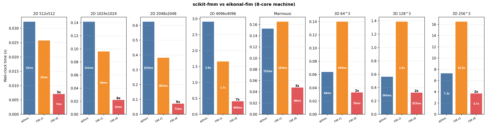
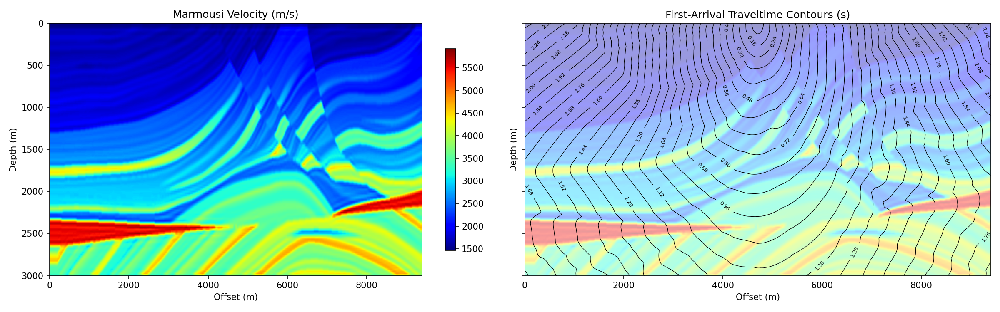
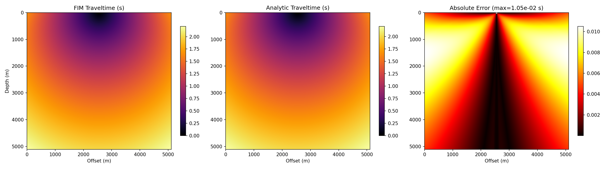
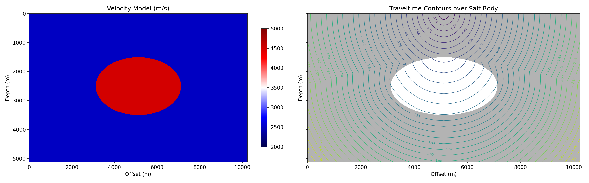

# eikonal-fim

A parallel eikonal equation solver using the Fast Iterative Method (FIM) in Rust.

Computes first-arrival traveltimes on regular 2D and 3D Cartesian grids with
heterogeneous velocity (or slowness) fields. The solver uses a lock-free
tile-based parallel scheduler that scales across all available cores.

> **Warning**
> This is experimental research code. There is no guarantee of correctness
> or fitness for any particular use. Use at your own risk. 

## Features

- **2D and 3D** support via Rust const generics
- **Parallel tile scheduler** using lock-free queues and atomic bitsets — scales
  to all available cores with minimal contention
- **Godunov upwind discretization** with per-axis edge-averaged slowness and
  automatic cascading fallback (3D → 2D → 1D)
- **Multiple sources** per solve
- **NumPy (.npy) and MATLAB (.mat)** file I/O for velocity/slowness input and
  traveltime output
- **First-order accuracy** — O(h) convergence verified against analytical
  solutions and scikit-fmm

## Performance

On a 28-core machine, the parallel FIM solver is 4–12x faster than
single-threaded [scikit-fmm](https://github.com/scikit-fmm/scikit-fmm)
(first-order Fast Marching Method), depending on problem size and dimensionality:

| Problem | Nodes | skfmm | FIM (1 thread) | FIM (28 threads) | Speedup |
|---|---|---|---|---|---|
| 2D 1024x1024 | 1.0M | 0.21s | 0.14s | 0.03s | 7x |
| 2D 4096x4096 | 16.8M | 4.2s | 2.2s | 0.34s | 12x |
| 2D Marmousi 601x1881 | 1.1M | 0.22s | 0.23s | 0.04s | 5x |
| 3D 128^3 | 2.1M | 0.87s | 2.3s | 0.14s | 6x |
| 3D 256^3 | 16.8M | 10.9s | 27.3s | 1.2s | 9x |

In 2D the Rust FIM is faster than skfmm even single-threaded. In 3D the
iterative algorithm revisits more nodes than FMM, but parallelism more than
compensates.



## Requirements

### Building and running

- **Rust 1.73+** (uses `div_ceil` on stable)
- No other system dependencies — all Rust crates are fetched by Cargo

### Demos (`run_demos.sh`)

The demo script requires Python 3 with the following packages:

- [NumPy](https://numpy.org/)
- [matplotlib](https://matplotlib.org/)
- [scikit-fmm](https://github.com/scikit-fmm/scikit-fmm) (for the performance
  benchmark in Demo 5)

```bash
pip install numpy matplotlib scikit-fmm
```

### Verification testing

The Marmousi regression test (`tests/marmousi_skfmm.rs`) compares FIM output
against a precomputed scikit-fmm reference. Generating that reference requires
Python 3 with:

- [NumPy](https://numpy.org/)
- [scikit-fmm](https://github.com/scikit-fmm/scikit-fmm)

```bash
pip install numpy scikit-fmm
python3 test_fixtures/generate_marmousi_reference.py
```

The core Rust test suite (`cargo test`) has no Python dependency — the Marmousi
test is skipped automatically if the reference fixture is not present.

## Installation

```bash
cargo build --release
```

The release binary is at `./target/release/eikonal-fim`.

## CLI usage

```
eikonal-fim --dim <N> --size <SHAPE> --source <COORDS> [OPTIONS]
```

### Required arguments

| Flag | Description |
|---|---|
| `-d, --dim <N>` | Dimensionality (2 or 3) |
| `-s, --size <SHAPE>` | Grid size, comma-separated (e.g. `256,256` or `128,128,128`) |
| `--source <COORDS>` | Source coordinates in physical units (repeatable) |

### Options

| Flag | Default | Description |
|---|---|---|
| `--spacing <H>` | `1.0` | Grid spacing |
| `--slowness <MODE>` | `uniform:1.0` | Slowness field (see below) |
| `-t, --tolerance <TOL>` | `1e-6` | Convergence tolerance |
| `--tile-size <N>` | `8` (2D) / `4` (3D) | Tile edge length |
| `--max-local-iters <N>` | `4` | Gauss-Seidel iterations per tile activation |
| `--threads <N>` | all cores | Number of worker threads |
| `-o, --output <PATH>` | `output.npy` | Output file (`.npy` or `.mat`) |
| `--progress` | off | Print convergence progress to stderr |
| `--max-tile-pops <N>` | unlimited | Safety limit on total tile activations |

### Slowness modes

- `uniform:<val>` — constant slowness everywhere
- `gradient:<v0>,<g>` — linear velocity gradient v(z) = v0 + g\*z, converted to
  slowness internally
- `slowness-file:<path>` — load a slowness field from `.npy` or `.mat`
- `velocity-file:<path>` — load a velocity field and convert to slowness (1/v)

### Examples

Homogeneous 2D grid with a point source at the center:

```bash
eikonal-fim --dim 2 --size 512,512 --spacing 1.0 \
    --source "256.0,256.0" -o traveltime.npy
```

Marmousi velocity model with a surface source:

```bash
eikonal-fim --dim 2 --size 601,1881 --spacing 5.0 \
    --slowness "velocity-file:marmousi_vel.npy" \
    --source "0.0,4700.0" --tile-size 16 --threads 8 \
    --progress -o marmousi_tt.npy
```

3D homogeneous cube:

```bash
eikonal-fim --dim 3 --size 256,256,256 --spacing 1.0 \
    --source "128.0,128.0,128.0" --tile-size 4 -o cube_tt.npy
```

## Library usage

The solver is also available as a Rust library:

```rust
use eikonal_fim::{CartesianGrid, FimSolver};

let slowness = vec![1.0; 256 * 256];
let grid = CartesianGrid::<2>::new([256, 256], 1.0, slowness)?;

let mut solver = FimSolver::new(grid, 1e-6)?
    .with_tile_size([16, 16])?
    .with_threads(8);

solver.add_source([128.0, 128.0])?;
solver.solve(None)?;
solver.save("output.npy")?;
```

## Demos

The `run_demos.sh` script runs four demonstrations:

```bash
bash run_demos.sh
```

### Marmousi first-arrival traveltimes

First-arrival traveltime contours through the Marmousi velocity model
(601 x 1881, dx = 5 m), with a surface source at the center of the line.



### Linear velocity gradient — analytical comparison

Traveltime in a linear v(z) = 1500 + 0.5z medium compared against the
analytical arccosh solution. Maximum error is ~0.01 s on a 10 m grid.



### Salt body — high-contrast inclusion

Wavefront propagation through a synthetic model with a 4500 m/s elliptical
salt body embedded in a 2500 m/s background. Shows wavefront bending
and shadow-zone effects.



## Testing

```bash
# Unit tests and integration tests (53 total)
cargo test

# Generate the scikit-fmm reference fixture (requires Python, see Requirements)
python3 test_fixtures/generate_marmousi_reference.py

# Run all tests including the Marmousi regression test
cargo test

# Benchmarks
cargo bench
```

The test suite includes:

- **Unit tests** (46) — grid construction, tiling, update kernels, I/O
  round-trips, error handling
- **Verification tests** (6) — convergence rates, analytical solutions,
  heterogeneous media, multiple sources (2D and 3D)
- **Marmousi regression test** (1) — FIM vs scikit-fmm on the Marmousi model,
  asserting < 0.3% mean relative error and < 5 ms max absolute error

The Marmousi test is automatically skipped if the reference fixture or velocity
model is not present, so `cargo test` always succeeds without Python installed.

## Algorithm

The solver implements the Fast Iterative Method described in:

> Jeong, W.-K. and Whitaker, R. T., "A Fast Iterative Method for Eikonal
> Equations," *SIAM Journal on Scientific Computing*, 30(5), 2008.

Key implementation details:

- The grid is partitioned into tiles (default 8x8 in 2D, 4x4x4 in 3D)
- Active tiles are stored in a lock-free concurrent queue with an atomic bitset
  for deduplication
- Each tile activation performs multi-directional Gauss-Seidel sweeps using the
  Godunov upwind scheme
- When boundary node values change, neighboring tiles are automatically
  re-activated
- Slowness is edge-averaged (arithmetic mean of adjacent node values) for
  improved accuracy at velocity interfaces
- The quadratic solver cascades from full-dimensional to lower-dimensional
  fallbacks when the discriminant is negative

## Reproducibility

Single-threaded solves (`--threads 1`) are deterministic and produce identical
results across runs.

Multi-threaded solves are **not** bitwise reproducible. The lock-free tile
scheduler processes tiles in non-deterministic order depending on thread timing,
which can cause floating-point rounding differences in the final traveltime
values. These differences are at the level of the solver's convergence tolerance
and do not affect correctness.

If exact reproducibility is required, use `--threads 1`.

## Rust dependencies

| Crate | Purpose |
|---|---|
| `rayon` | Thread pool for parallel tile processing |
| `crossbeam-queue` | Lock-free concurrent queue |
| `ndarray` / `ndarray-npy` | N-dimensional arrays and NumPy I/O |
| `matfile` | MATLAB .mat file I/O |
| `clap` | CLI argument parsing |
| `anyhow` | Error handling in the binary |

## License

This project is licensed under the BSD 3-Clause License - see the [LICENSE](LICENSE) file for details.
